# Rime LiveKit Agents

This repository demonstrates how to set up both a frontend and a LiveKit-powered backend, enabling customers to easily clone and start using the project for their own conversational AI applications. The project is structured for flexibility: you can use the backend and frontend together, or run the backend independently in console mode. 

The core demonstration includes setting up a pipeline with SST (speech-to-text), LLM (large language model), and TTS (text-to-speech) models to create a conversational bot. This bot can be used directly via Python scripts or run in development mode with a frontend that provides real-time audio streaming and text transcription.

This repository serves as an example and starting point for integrating real-time conversational AI experiences using LiveKit, making it easy for users to adapt the setup to their own needs.

## Before You Start

If this is your first time working with LiveKit, we highly recommend spending some time reviewing the official documentation to understand the platform and its capabilities:

- **LiveKit Overview:** Learn the basics of LiveKit, including rooms, participants, and tracks: [LiveKit Docs](https://docs.livekit.io/home/)
- **LiveKit Agents:** Understand how to build and run AI agents with LiveKit: [LiveKit Agents Docs](https://docs.livekit.io/agents/)
- **LiveKit SIP Integration:** If you plan to connect to phone numbers or telephony systems, see: [LiveKit SIP Docs](https://docs.livekit.io/sip/)

Familiarizing yourself with these resources will give you a strong foundation for using and extending this repository.

> **Note:** You can also test the code directly without reading the documentation if you want to quickly see how it works. The repository is designed to be easy to set up and run out of the box for experimentation.

## Architecture Overview

The following diagram illustrates the high-level architecture of this project:

```mermaid
flowchart TD
    U["👤 User<br/>(speaks)"] --> L["🏠 LiveKit Room<br/>(real-time audio)"]
    L --> V["🤖 Voice Agent<br/>(listens & responds)"]
    V --> S["🎤 Speech-to-Text"]
    S --> A["🧠 AI Brain<br/>(understands & thinks)"]
    A --> T["🎧 Text-to-Speech"]
    T --> L
    L --> U
```

