# Rime LiveKit Agents

This repository demonstrates how to set up both a frontend and a LiveKit-powered backend, enabling customers to easily clone and start using the project for their own conversational AI applications. The project is structured for flexibility: you can use the backend and frontend together, or run the backend independently in console mode. 

The core demonstration includes setting up a pipeline with SST (speech-to-text), LLM (large language model), and TTS (text-to-speech) models to create a conversational bot. This bot can be used directly via Python scripts or run in development mode with a frontend that provides real-time audio streaming and text transcription.

This repository serves as an example and starting point for integrating real-time conversational AI experiences using LiveKit, making it easy for users to adapt the setup to their own needs.

## Before You Start

If this is your first time working with LiveKit, we highly recommend spending some time reviewing the official documentation to understand the platform and its capabilities:

- **LiveKit Overview:** Learn the basics of LiveKit, including rooms, participants, and tracks: [LiveKit Docs](https://docs.livekit.io/home/)
- **LiveKit Agents:** Understand how to build and run AI agents with LiveKit: [LiveKit Agents Docs](https://docs.livekit.io/agents/)
- **LiveKit SIP Integration:** If you plan to connect to phone numbers or telephony systems, see: [LiveKit SIP Docs](https://docs.livekit.io/sip/)

Familiarizing yourself with these resources will give you a strong foundation for using and extending this repository.

> **Note:** You can also test the code directly without reading the documentation if you want to quickly see how it works. The repository is designed to be easy to set up and run out of the box for experimentation.

## Architecture Overview

The following diagram illustrates the high-level architecture of this project:

```mermaid
flowchart TD
    U["👤 User<br/>(speaks)"] --> L["🏠 LiveKit Room<br/>(real-time audio)"]
    L --> V["🤖 Voice Agent<br/>(listens & responds)"]
    V --> S["🎤 Speech-to-Text"]
    S --> A["🧠 AI Brain<br/>(understands & thinks)"]
    A --> T["🎧 Text-to-Speech"]
    T --> L
    L --> U
```



## Setup: Required API Keys

Before setting up the project, you need to obtain API keys for all required services and add them to a `.env` file in the project root. These keys are necessary to connect to LiveKit rooms and enable speech-to-text (STT), large language model (LLM), and other AI features.

Add the following keys to your respective `.env` file:

```
LIVEKIT_API_KEY=<your_api_key>
LIVEKIT_API_SECRET=<your_api_secret>
LIVEKIT_URL=wss://<project-subdomain>.livekit.cloud
RIME_API_KEY=<your_rime_api_key>
DEEPGRAM_API_KEY=<your_deepgram_api_key>
OPENAI_API_KEY=<your_openai_api_key>
```

### How to Obtain the Keys

- **LiveKit API Keys:**
  - Sign up or log in at [LiveKit Cloud](https://cloud.livekit.io/login)
  - Go to Settings → API Keys to generate your API key, secret, and get your project URL.
- **RIME_API_KEY:**
  - Obtain from your Rime account at [Rime Tokens](https://app.rime.ai/tokens/).
- **Deepgram API Key:**
  - Sign up or log in at [Deepgram Console](https://console.deepgram.com/project/b10a1314-1443-4796-811f-f099e5da682e) to generate your API key.
- **OpenAI API Key:**
  - Sign up or log in at [OpenAI Platform](https://platform.openai.com/settings/organization/api-keys) to generate your API key.

Make sure to keep your API keys secure and never share them publicly.

## Installation and Setup

There are two ways to set up this project:
1. Using the automated setup script (recommended)
2. Manual setup

### Option 1: Quick Setup Using Setup Script (Recommended)

We provide a powerful setup script that automates the entire installation process. The script handles both frontend and backend setup, including environment configuration and dependency installation.

#### Prerequisites

Before running the setup script, ensure you have:

1. **Python 3.9 or higher** installed
   ```sh
   # Check your Python version
   python --version
   # or
   python3 --version
   ```
   If you need to update Python, visit [python.org/downloads](https://www.python.org/downloads/)

2. **pnpm** package manager installed
   ```sh
   # Install pnpm using npm
   npm install -g pnpm
   
   # Verify installation
   pnpm --version
   ```

#### Running the Setup Script

1. **Clone the repository:**
   ```sh
   git clone https://github.com/rimelabs/rime-livekit-agents.git
   cd rime-livekit-agents/Rime-simple-agent
   ```

2. **Run the setup script:**
   ```sh
   python setup.py
   ```

   The script will guide you through the setup process and prompt for:
   - Frontend folder name (defaults to "frontend")
   - Required API keys and credentials

#### Available Setup Modes

The setup script supports different modes of operation:

1. **Development Mode (Default):**
   ```sh
   python setup.py dev
   ```
   - Sets up and runs both frontend and backend servers
   - Opens a web interface at http://localhost:3000

2. **Console Mode:**
   ```sh
   python setup.py console
   ```
   - Runs only the backend agent in terminal mode
   - Useful for testing or command-line interactions

#### Additional Setup Options

The script also provides maintenance options:

- **Reset Installation:**
  ```sh
  python setup.py --reset
  ```
  - Removes all created files and directories
  - Useful for cleaning up the installation

- **Restart Installation:**
  ```sh
  python setup.py --restart
  ```
  - Resets and immediately starts a fresh installation
  - Helpful when you want to reconfigure everything

#### What the Setup Script Handles

The setup script automates:
- Repository cloning and configuration
- Environment file creation
- Virtual environment setup
- Dependency installation
- Frontend and backend server startup
- API key configuration

Once the setup is complete, both frontend and backend services will start automatically in the selected mode. You can stop the servers at any time by pressing Ctrl+C.

### Option 2: Manual Setup

If you prefer to set up the project manually or need more control over the installation process, follow these steps:

#### Frontend Setup

1. **Clone and navigate to the repository:**
   ```sh
   git clone https://github.com/rimelabs/rime-livekit-agents.git
   cd rime-livekit-agents
   ```

2. **Navigate to the frontend directory:**
   ```sh
   cd frontend
   ```

3. **Create your environment file:**
   ```sh
   touch .env
   # Add the following keys to your .env file:
   LIVEKIT_API_KEY=<your_api_key>
   LIVEKIT_API_SECRET=<your_api_secret>
   LIVEKIT_URL=wss://<project-subdomain>.livekit.cloud
   ```
   Replace the placeholders with your actual LiveKit credentials.

4. **Install dependencies:**
   ```sh
   pnpm install
   ```

5. **Start the frontend development server:**
   ```sh
   pnpm run dev
   ```

The frontend should now be running locally and ready to connect to your LiveKit backend.

#### Backend Setup

1. **Navigate to the backend directory:**
   ```sh
   cd backend
   ```

2. **Create and activate a Python virtual environment:**
   ```sh
   python3 -m venv .venv
   source .venv/bin/activate
   ```

3. **Install dependencies:**
   ```sh
   pip install -r requirements.txt
   ```

4. **Download required model files:**
   ```sh
   python rime_agent.py download-files
   ```

5. **Create your environment file:**
   ```sh
   touch .env
   # Add the following keys to your .env file:
   LIVEKIT_URL=<your LiveKit server URL>
   LIVEKIT_API_KEY=<your API Key>
   LIVEKIT_API_SECRET=<your API Secret>
   OPENAI_API_KEY=<your OpenAI API Key>
   RIME_API_KEY=<your Rime API Key>
   DEEPGRAM_API_KEY=<your Deepgram API Key>
   ```
   Replace the placeholders with your actual API credentials.

6. **Run the agent in different modes:**

   - **Development mode (connects to LiveKit, for use with the frontend UI):**
     ```sh
     python rime_agent.py dev
     ```
   - **Console mode (test directly from the terminal):**
     ```sh
     python rime_agent.py console
     ```
   - **Production mode (for deployment):**
     ```sh
     python rime_agent.py start
     ```

For more details on running and testing your agent, see the [LiveKit Voice AI Quickstart](https://docs.livekit.io/agents/start/voice-ai/#speak-to-your-agent).

