# Rime Multilingual Agent

## Overview

The Rime Multilingual Agent is a demonstration of how to build a voice assistant that seamlessly switches between languages during a conversation. This example was created to address a common challenge many developers face: **how to detect the user's language and dynamically update TTS parameters on the fly**.

This project clearly demonstrates:
- How to override the `stt_node` to intercept speech events and detect language changes
- How to dynamically update Rime TTS parameters (speaker, language, model) based on detected language
- A complete multilingual voice pipeline: **Deepgram STT → OpenAI LLM → Rime TTS**

Currently supported languages:
- 🇺🇸 English
- 🇪🇸 Spanish  
- 🇫🇷 French
- 🇩🇪 German

## How It Works

The key insight is overriding the `stt_node` method in your Agent class. This allows you to intercept speech-to-text events, extract the detected language, and update TTS settings accordingly.

```mermaid
flowchart TD
    U["👤 User speaks<br/>(any supported language)"] --> L["🏠 LiveKit Room"]
    L --> STT["🎤 Deepgram STT<br/>(multi-language mode)"]
    STT --> D{"🔍 Language<br/>Detection"}
    D -->|Language Changed| TTS_UPDATE["⚙️ Update Rime TTS<br/>(speaker, lang, model)"]
    D --> LLM["🧠 OpenAI LLM<br/>(responds in same language)"]
    LLM --> TTS["🎧 Rime TTS<br/>(language-matched voice)"]
    TTS --> L
    L --> U
```



## Before You Start

If this is your first time working with LiveKit, we recommend reviewing the official documentation:

- **LiveKit Overview:** Learn the basics of LiveKit, including rooms, participants, and tracks: [LiveKit Docs](https://docs.livekit.io/home/)
- **LiveKit Agents:** Understand how to build and run AI agents with LiveKit: [LiveKit Agents Docs](https://docs.livekit.io/agents/)

> **Note:** You can also jump straight into testing the code if you want to quickly see multilingual switching in action.

## Setup: Required API Keys

Create a `.env` file in the `rime-multilingual-agent` directory with the following:

```env
LIVEKIT_API_KEY=<your_api_key>
LIVEKIT_API_SECRET=<your_api_secret>
LIVEKIT_URL=wss://<project-subdomain>.livekit.cloud
RIME_API_KEY=<your_rime_api_key>
DEEPGRAM_API_KEY=<your_deepgram_api_key>
OPENAI_API_KEY=<your_openai_api_key>
```

### How to Obtain the Keys

- **LiveKit API Keys:**
  - Sign up or log in at [LiveKit Cloud](https://cloud.livekit.io/login)
  - Go to Settings → API Keys to generate your API key, secret, and get your project URL
- **Rime API Key:**
  - Obtain from your Rime account at [Rime Tokens](https://app.rime.ai/tokens/)
- **Deepgram API Key:**
  - Sign up or log in at [Deepgram Console](https://console.deepgram.com/) to generate your API key
- **OpenAI API Key:**
  - Sign up or log in at [OpenAI Platform](https://platform.openai.com/settings/organization/api-keys) to generate your API key

## Installation and Setup

### 1. Clone the Repository

```bash
# Using HTTPS
git clone https://github.com/rimelabs/rime-livekit-agents.git

# Or using SSH
git clone git@github.com:rimelabs/rime-livekit-agents.git
```

### 2. Navigate to Project Directory

```bash
cd rime-livekit-agents/rime-multilingual-agent
```

### 3. Install Dependencies

The project uses `uv` for package management. If you don't have it installed:

```bash
brew install uv  # For macOS using Homebrew
```

### 4. Install Packages

```bash
uv sync
```

### 5. Download Required Model Files

This step is required only once to set up the turn-detector, silero, and noise-cancellation plugins:

```bash
uv run main.py download-files
```

### 6. Running the Agent

The agent can be run in three different modes:

1. **Console Mode** - Run in terminal for local testing:
   ```bash
   uv run main.py console
   ```

2. **Development Mode** - Connect to LiveKit for internet-accessible testing:
   ```bash
   uv run main.py dev
   ```

3. **Production Mode** - Run in production environment:
   ```bash
   uv run main.py start
   ```

> **Note:** This example intentionally does not include noise-cancellation. When testing with other voice agents or audio sources, noise-cancellation can filter out those sounds. For real-world deployments, you can enable noise-cancellation as needed.

## Further Reading

For detailed instructions on running and testing your agent, see the [LiveKit Voice AI Quickstart](https://docs.livekit.io/agents/start/voice-ai/#speak-to-your-agent).
