# Rime Simple Agent

## Overview

The Rime Simple Agent is an example implementation that demonstrates a complete voice conversation pipeline using LiveKit and Rime. It showcases a seamless integration of Speech-to-Text (STT) → Large Language Model (LLM) → Text-to-Speech (TTS) for natural, bidirectional voice conversations.

This project serves as a reference implementation designed to help developers and customers:
- Understand how to integrate LiveKit with Rime
- Explore a working end-to-end voice conversation system
- Get started quickly with a functional codebase
- Use as a foundation for building custom voice applications

The example is intentionally kept simple and well-documented to make it easy to clone, understand, and modify for your specific use cases.

## Before You Start

If this is your first time working with LiveKit, we highly recommend spending some time reviewing the official documentation to understand the platform and its capabilities:

- **LiveKit Overview:** Learn the basics of LiveKit, including rooms, participants, and tracks: [LiveKit Docs](https://docs.livekit.io/home/)
- **LiveKit Agents:** Understand how to build and run AI agents with LiveKit: [LiveKit Agents Docs](https://docs.livekit.io/agents/)
- **LiveKit SIP Integration:** If you plan to connect to phone numbers or telephony systems, see: [LiveKit SIP Docs](https://docs.livekit.io/sip/)

Familiarizing yourself with these resources will give you a strong foundation for using and extending this repository.

> **Note:** You can also test the code directly without reading the documentation if you want to quickly see how it works. The repository is designed to be easy to set up and run out of the box for experimentation.

## Architecture Overview

The following diagram illustrates the high-level architecture of this project:

```mermaid
flowchart TD
    U["👤 User<br/>(speaks)"] --> L["🏠 LiveKit Room<br/>(real-time audio)"]
    L --> V["🤖 Voice Agent<br/>(listens & responds)"]
    V --> S["🎤 Speech-to-Text"]
    S --> A["🧠 AI Brain<br/>(understands & thinks)"]
    A --> T["🎧 Text-to-Speech"]
    T --> L
    L --> U
```



## Setup: Required API Keys

Before setting up the project, you need to obtain API keys for all required services and add them to a `.env` file in the project root. These keys are necessary to connect to LiveKit rooms and enable speech-to-text (STT), large language model (LLM), and other AI features.

Create a `.env` file in the `rime-simple-agent` directory with the following content:

```env
LIVEKIT_API_KEY=<your_api_key>
LIVEKIT_API_SECRET=<your_api_secret>
LIVEKIT_URL=wss://<project-subdomain>.livekit.cloud
RIME_API_KEY=<your_rime_api_key>
DEEPGRAM_API_KEY=<your_deepgram_api_key>
OPENAI_API_KEY=<your_openai_api_key>
```

### How to Obtain the Keys

- **LiveKit API Keys:**
  - Sign up or log in at [LiveKit Cloud](https://cloud.livekit.io/login)
  - Go to Settings → API Keys to generate your API key, secret, and get your project URL
- **Rime API Key:**
  - Obtain from your Rime account at [Rime Tokens](https://app.rime.ai/tokens/)
- **Deepgram API Key:**
  - Sign up or log in at [Deepgram Console](https://console.deepgram.com/project/b10a1314-1443-4796-811f-f099e5da682e) to generate your API key
- **OpenAI API Key:**
  - Sign up or log in at [OpenAI Platform](https://platform.openai.com/settings/organization/api-keys) to generate your API key
